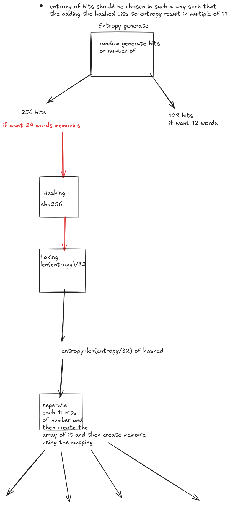
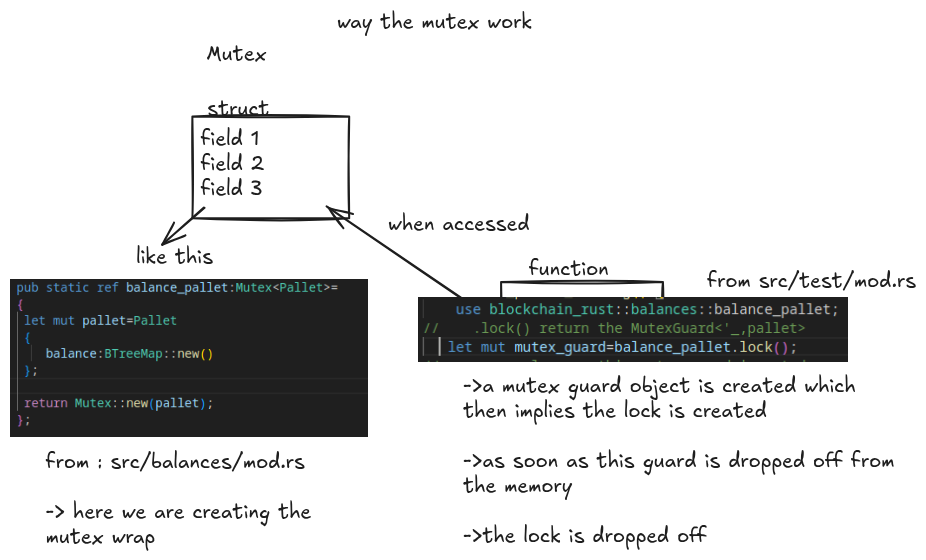

# Blockchain

##### A blockchain implementation using rust ,with bip32 using edsa25519 rather than the sekp256k1 just like the solana

way of creating the memonics the 

### a slight overview of how do the Mutex Guard works

* first we have created the lazy_static wrapper around the pallet this ensures that the mutex static is stored inside of the static binding of the program

* now it also ensures that the pallet struct is initialized during the time of runtime ,the lazy_static just reserves the memory in the static for the to be initialized in the runtime

* when the lock is called the mutex object is created and as long as the mutex guard object remain in the scope
the lock will be remained as soon as the mute guard is dropped off from the memory the lock is dropped

#### WARNING:We are using the no td feaure of the lazy static meaning the spin lock version of mutex we are using is the cpu extensive and is often used for the bare metal ,Use std version over the no std version